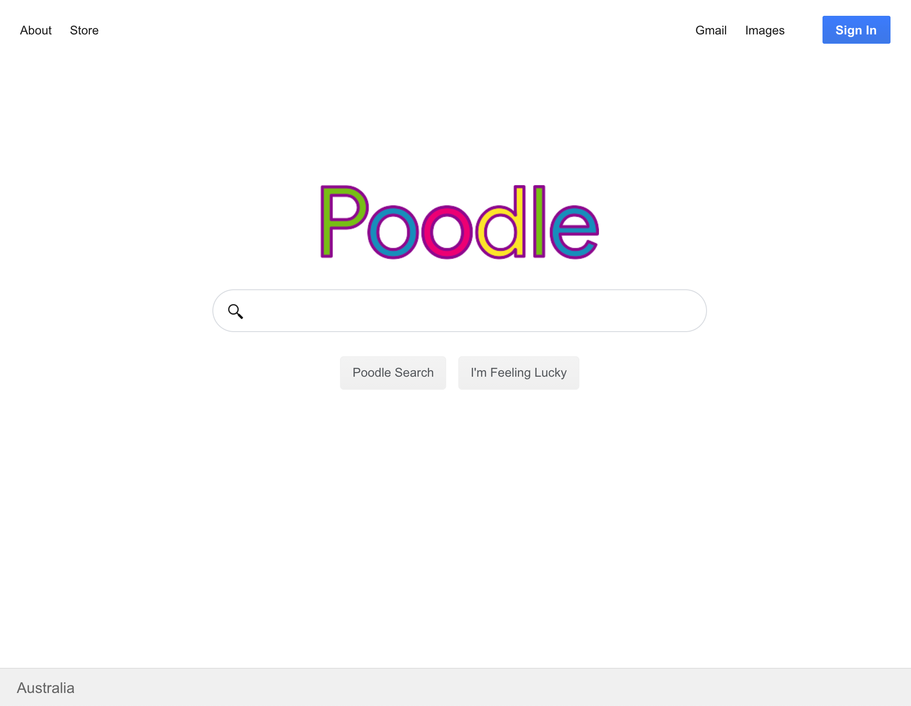

# Poodle Search 

#### Demo [here]()

This was part of a comapny coding challenge that I decided to replicate the popular search engine UI, have a guess which one that was. 

The serach querys a sometimes *SLOW* API (so the dog might run a few circles before the results load) this API has a limited database of existing demonstration files. 

My aim is to imporve the UI and make is have almost all the feature that the inspiration search engine has at the moment. 

### Technologies used: 
- React, React Hooks, React Router 
- Axios for HTTP requests

The biggest challenge here was moving from Class based compoents to using Hooks and refactoring the code for it to work with the new useState() hook. In the end it seems a lot more intuitive and the redability is improved ten-fold in my opinion. 

It was fun to implement the loading screen and clone the worlds most popular search engine. 

Hope you enjoy using the demo.

p.s. Don't be evil. 